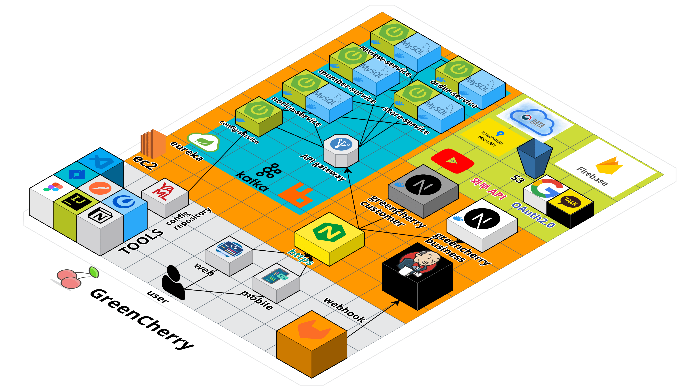

#  음식 마감 할인 서비스, GreenCherry 

## 1. 프로젝트 개요

### 1) 프로젝트 목표
식당, 빵집, 카페등 마감 시간에 남은 재료, 음식들을 싼 가격에 사고 팔 수 있는 서비스입니다. 
주로 유통기한이 임박한 제품이나 당일에 팔지 못한 음식을 저렴하게 구매, 판매할 수 있습니다.
 
 

### 2) 기획 배경
지구 온실 가스 8~ 10%, 버려진 음식에서 발생한다. 실제로 먹을 수 있는 음식 17% 는 음식물 쓰레기통으로 가는 것을 알 수 있다.음식물 쓰레기 처리 기기가 인기를 끄는 것도 그만큼 버리는 음식이 꽤 많다는 증거로 볼 수 있다.

음식물 스레기로 인한 피해는 환경훼손, 경제적 낭비, 사회적 문제등을 들 수 있다.

음식물은 생산, 수입, 유통, 가공 및 조리 단계에서 많은 에너지와 비용을 소모하는 에너지 집약체입니다. 그렇기 때문에 음식물 쓰레기 해결 문제보다는 애초에 발생에 대하여 원천 봉쇄하기 위해 이 프로젝트를 기획했습니다.

[경향신문 먹을 수 있는 음식 17% ‘쓰레기통으로’](https://www.khan.co.kr/environment/environment-general/article/202103142111035)

[음식물쓰레기로 인한 피해](http://kfem.or.kr/?p=229388)

 
 

### 3) 주요 기능
1. 가게 등록
- 사업자 등록번호 검증
2. 랜덤 박스 등록
3. 주문 하기
4. 구독 하기
5. 리뷰
6. 해당 어플 관련 유튜브
7. 근처 랜덤 박스 등록된 가게 조회
8. 내 정보 조회
- 주문 내역 조회
- 리뷰 관리
- 구독 내역 조회

 
 

### 4) 전체 일정 📅
23.04.10 ~ 23.05.19 (6주)
| 기간          | 내용                                 |
| ------------- | ------------------------------------ |
| 04.10 ~ 04.12 | 아이디어 선정                        |
| 04.13 ~ 04.15 | 요구사항 분석 및 기능 명세서 작성    |
| 04.18 ~ 04.20 | 와이어프레임, REST API 작성, DB 설계          |
| 04.21 ~ 04.22  | 발표자료 준비 및 중간 발표         |
| 04.24 ~ 04.25 | front, back 환경 설정, 서비스 배포 자동화|
| 04.26 ~ 04.28 | 회원가입, 로그인 등 회원 서비스 개발 |
| 05.01 ~ 05.12 | 리뷰, 알림, 주문, 상점 개발       |
| 05.15 ~ 05.17 | 서비스 유지보수         |
| 05.18 ~ 05.19 | 발표 준비 및 최종 발표  |

 

### 5) 구성원 🥰
<table>
  <tr>
    <td align="center"><b>Name</b></td>
    <td align="center"><b>김건현</b></td>
    <td align="center"><b>김수빈</b></td>
    <td align="center"><b>박태환</b></td>
    <td align="center"><b>서영탁</b></td>
    <td align="center"><b>이채은</b></td>
    <td align="center"><b>조성욱</b></td>
  </tr>
  <tr>
    <td align="center"><b>Github</b></td>
    <td align="center"><a href="https://github.com/gggeon96"></td>
    <td align="center"><a href="https://github.com/tabss2003"></td>
    <td align="center"><a href="https://github.com/pthwan27"> </td>
    <td align="center"><a href="https://github.com/0takkk"> </td>
    <td align="center"><a href="https://github.com/rachaen"> </td>
    <td align="center"><a href="https://github.com/chodone"> </td>
  </tr>
  <tr>
    <td align="center"><b>Position</b></td>
    <td align="center"><b>Backend</b></td>
    <td align="center"><b>Backend</b></td>
    <td align="center"><b>👑 Frontend</b></td>
    <td align="center"><b>Backend</b></td>
    <td align="center"><b>Frontend</b></td>
    <td align="center"><b>Frontend</b></td>
  </tr>
</table>

 
 

## 2. 프로젝트 설계

### 1) 피그마
[피그마 - 웹](https://www.figma.com/file/HHHCRXmxWoOtvao6JReYe1/Untitled?type=design&node-id=4-10&t=tLmDv2tj5l7DGPyc-0)

[피그마 - 모바일](https://www.figma.com/file/HHHCRXmxWoOtvao6JReYe1/Untitled?type=design&node-id=4-8&t=tLmDv2tj5l7DGPyc-0)

 

### 2) 개발환경

| Backend            | Frontend   | CI      | Collaboration Tools |
| ------------------ | ---------- | ------- | ------------------- |
| Java 11            | React      | AWS EC2 | GitLab              |
| Spring Boot Gradle | PWA        | Docker  | Jira                |
| Spring Data JPA    | JavaScript | Jenkins | Notion              |
| QueryDSL           | Redux      |         | Discord             |
| JWT                | AWS S3     |         |                     |
| Spring Security    | next.js    |         |                     |
| MySQL              | Axios      |         |                     |
| Redis              | Husky      |         |                     |
| MSA                | BFF        |         |                     |
| feign              | FCM        |         |                     |
| kafka              |            |         |                     |
| FCM                |            |         |                     |
| RabbitMQ           |            |         |                     |
| AWS S3             |            |         |                     |

 

### 3) 외부 서비스
- 공공데이터 api (사업자 번호 진위 여부, 영업신고 조회)
- Kakao Map api
- Kakao OAuth
- Google OAuth
- Firebase Cloud Messaging
- AWS S3

 

### 4) ERD

 

### 5) 아키텍처

 

### 6) [REST API](https://friendly-antimatter-c82.notion.site/API-9be663a606a14e43970806ea6a6228dd)

 

## 3. 프로젝트 소개

 

## 4. 발표 자료
